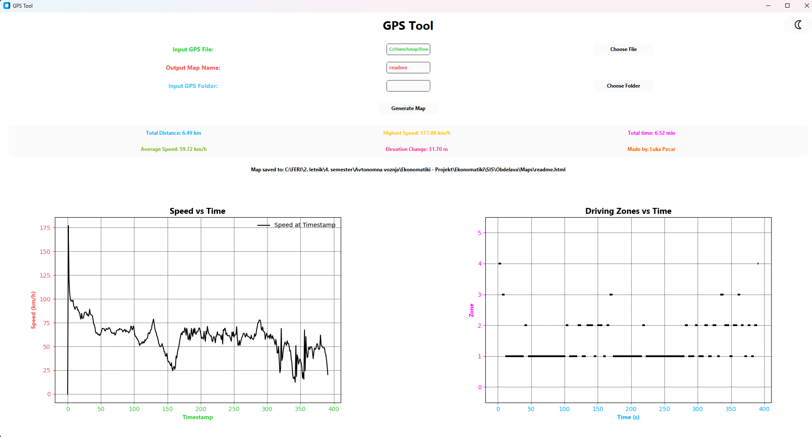
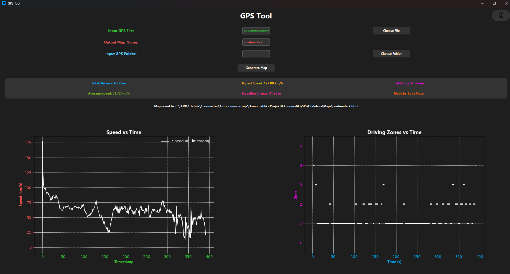

# Aplikacija za analizo vožnje iz .gpx datotek

Ta aplikacija omogoča analizo vožnje na podlagi podatkov iz `.gpx` datotek. Iz surovih GPS podatkov pridobi hitrost, jih obdela, zgladi in oceni stopnjo vožnje za vsak posamezen trenutek. Aplikacija je bila razvita z namenom priprave podatkov za nadaljnjo uporabo v strojni obdelavi, kot je uporaba v nevronskih mrežah.

## Funkcionalnosti

- Uvoz ene ali več `.gpx` datotek
- Glajenje hitrosti z minimalnim vplivom na natančnost (spremembe < 0.5 km/h)
- Izračun stopnje vožnje glede na odstotek spremembe hitrosti za vsako sekundo
- Samodejna izdelava interaktivnega zemljevida vožnje v `.html` obliki
- Izpis splošnih statistik vožnje za analizo in debug
- Generiranje grafa, ki prikazuje hitrost skozi čas
- Generiranje grafa, ki prikazuje stopnjo skozi čas
- Podpora za svetli (privzeti) in temni način delovanja uporabniškega vmesnika
- Pregledna struktura izhodnih datotek po mapah

## Izhodni podatki

Aplikacija ustvari naslednje tipe izhodnih datotek:

- `.csv` datoteka z vrsticami v formatu:  
  `[sekunda], [hitrost], [stopnja]`
- `.txt` datoteka z vrsticami v formatu:  
  `[od]-[do]: [stopnja]`
- `.html` interaktivni zemljevid vožnje
- Vizualni graf stopnje skozi čas za namen pregleda in debugganja

## Izhodne zbirke

Analysis - Analizirani podatki (.csv, .txt)

Assets - Dodatki potrebni za delovanje programa

Maps - Interaktivni zemljevidi voženj (.html)

## Natančnost analize

- Pri lastni vožnji je bila dosežena približno 80 % natančnost, saj so subjektivne ocene pogosto drugačne od meritev (zaradi mikro sprememb hitrosti itd.)
- Za druge uporabnike je ocenjena natančnost približno 70 %, saj ti običajno niso tako natančni pri ocenjevanju svojih voženj
- Glajenje hitrosti ima zelo majhen vpliv na natančnost – večinoma pod 0.5 km/h spremembe, kar je v okviru tolerance pri merjenju hitrosti

## Priprava podatkov za nadaljnjo uporabo

Aplikacija omogoča, da vsak član skupine pridobi strukturirane podatke za nadaljnjo obdelavo, kot so:

- Hitrost (direktno iz `.csv`)
- Pospešek (izračun iz zaporednih hitrosti)
- Koordinate (direktno iz `.gpx` datotek)

## Uporabniški vmesnik

Uporabniški vmesnik je izboljšan z mehkejšimi barvnimi prehodi, svetlejšimi barvami za svetli način, prilagojenim kontrastom zemljevidov in dodatkom grafa stopnje. Omogočena je tudi možnost preklopa med svetlim in temnim načinom delovanja.

### Privzeti način (light mode)

Privzeti način aplikacije je svetli način za boljšo vidljivost, skladno s predlogom mentorja.

### Temni način (dark mode)

Temni način ostaja na voljo za uporabnike, ki raje uporabljajo temnejše barvne sheme.

