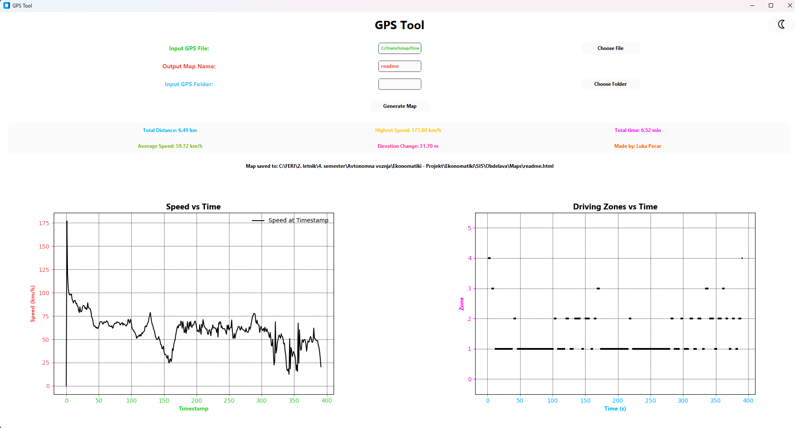
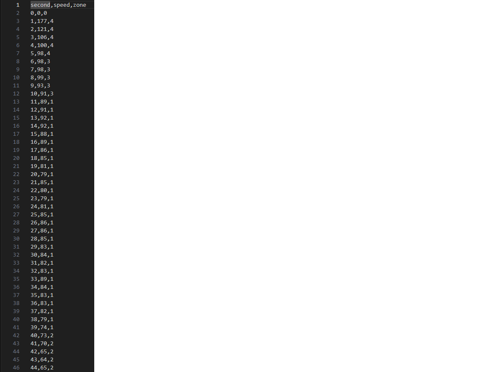

# Signali in slike

Ta zbirka je namenjena datotekam povezanim z predmetom signali in slike

## Testni podatki

#### Osnovni podatki

Znotraj zbirke SIS se nahaja zbirka Zgled

V zbirki se nahaja datoteka testni_podatki.gpx

Namen te datoteke je nuditi članu skupine ali uporabniku nuditi hiter zgled .gpx datoteke, katera je pravilnega formata za obdelavo

V zbirki se nahaja datoteka oznaceni_podatki.txt

Namen te datoteke je članu skupine ali uporabniku nuditi hiter zgled .txt datoteke, katera je željenega formata po opravljenem ročnem označevanju podatkov

### Primer izgleda programa po obdelavi ene datoteke

### Primer izhodne datoteke

### Primer zemljevida, katerega ustvari program

